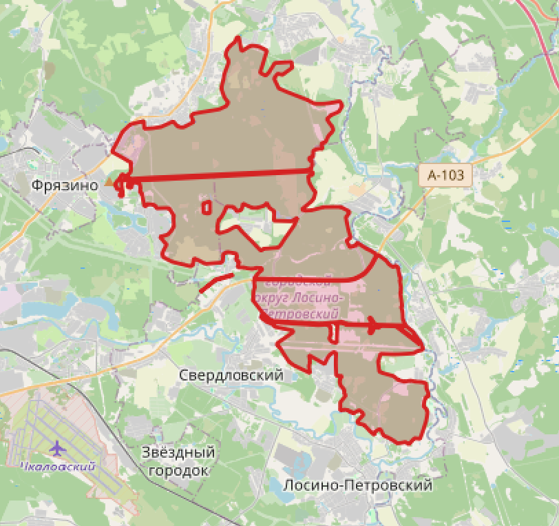
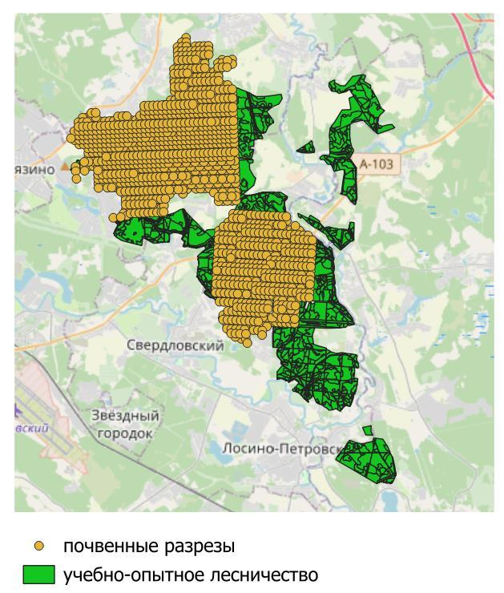
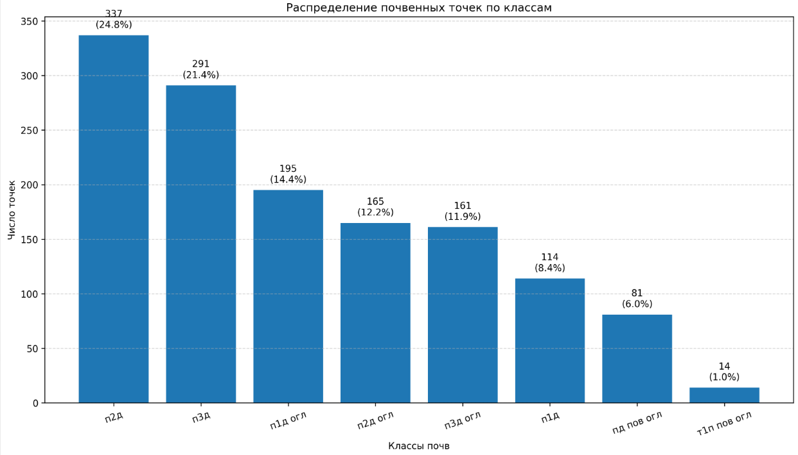
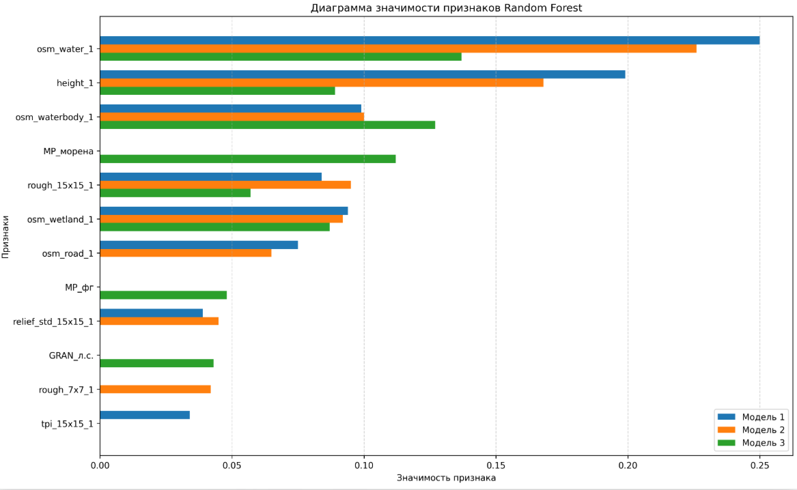
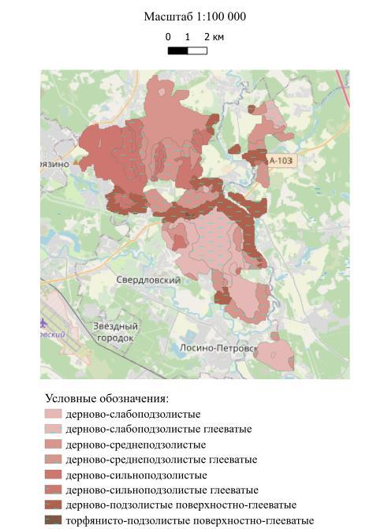
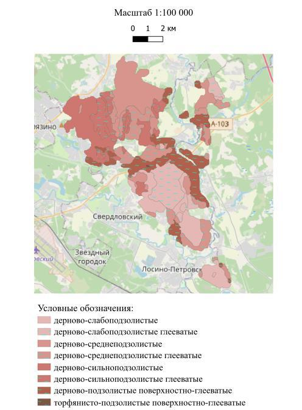
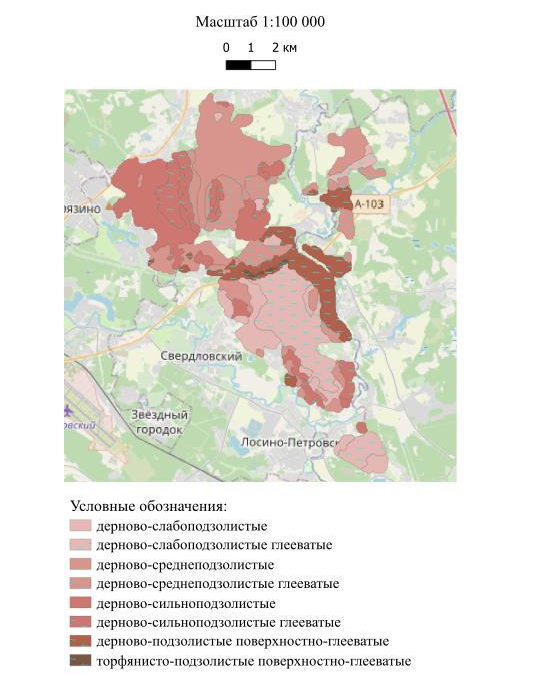

# Цифровое картографирование почв

Классификация и пространственный прогноз почвенного покрова
по полевым наблюдениям и пространственным признакам.
Проект объединяет подготовку пространственных данных в QGIS и обучение
моделей классификации на Python.

**Итоговый алгоритм исследования: Random Forest с подбором гиперпараметров
через Optuna, 8 исходных классов почв.** Лучший результат среди трёх
вариантов Random Forest получен для модели 3 без синтетической балансировки:

| Точность | Сбалансированная точность | Макро-F1 | Взвешенная F1 |
|---:|---:|---:|---:|
| **82.94%** | **80.85%** | **0.8019** | **0.8303** |

Оценка выполнена на 340 отложенных почвенных наблюдениях. Сохранены также
код и сводные результаты предыдущих экспериментов XGBoost.

## Постановка задачи

Почвенные разрезы с известным типом почвы расположены только на части
территории. Требовалось установить связь между почвенным классом и
характеристиками местоположения, а затем получить прогноз для регулярной
сетки, включая участки без разрезов.

Это **многоклассовая классификация**: целевая переменная `Soil` содержит
категорию почвы, а предикторы описывают рельеф, условия увлажнения,
лесорастительные и почвенно-геологические характеристики. Выход модели:
класс почвы и оценки вероятностей классов.

| Модель | Состав признаков | Назначение |
|---|---|---|
| **Модель 1** | Рельеф + ТЛУ | Прогноз на территории с доступными таксационными данными |
| **Модель 2** | Только рельеф | Прогноз без ТЛУ, GRAN и MP, в том числе за пределами обучающей территории |
| **Модель 3** | Рельеф + ТЛУ + GRAN + MP | Оценка вклада гранулометрического состава и материнской породы |

В названиях моделей **«рельеф» означает весь общий пространственный набор**:
морфометрические, гидрологические, OSM- и многомасштабные показатели.
OSM и многомасштабные показатели не выделяются в отдельную модель.
Числа 7 и 8 в вариантах экспериментов обозначают **число почвенных классов**,
а не число признаков.

## Часть 1. Подготовка данных и карт в QGIS

### Исходные данные



| Данные | Содержание и использование |
|---|---|
| **1358 почвенных наблюдений** | Геометрия точек, тип почвы `Soil`, гранулометрический состав `GRAN`, материнская порода `MP` |
| **SRTM, слой `obrezka`** | Цифровая модель высот и основа расчёта производных показателей |
| **Граница территории** | Область анализа и маска итоговых карт |
| **Таксационный слой** | Лесные выделы с полем типа лесорастительных условий, приведённым к `TLU` |
| **OpenStreetMap** | Водотоки, водоёмы, заболоченные территории и дороги |

Рабочий проект: [`gis/diplom_mag.qgz`](gis/diplom_mag.qgz).
Обработка выполнена в QGIS 3.44; система координат проекта **EPSG:32637**,
метрическая проекция UTM, зона 37N.



*Почвенные разрезы и территория исследования. Неравномерное покрытие
разрезами определяет необходимость пространственного прогноза.
Подложка карт: © участники OpenStreetMap.*

### Последовательность геоинформационной работы

1. **Подготовка слоёв.** Загружены граница территории, почвенные точки,
   таксационные выделы и цифровая модель рельефа. Проверены геометрия,
   система координат и атрибутивные поля; данные приведены к рабочей
   системе координат.
2. **Расчёт морфометрии.** По цифровой модели рельефа получены высота,
   уклон, экспозиция, профильная и тангенциальная кривизна, TPI, TRI
   и шероховатость поверхности.
3. **Гидрологические расчёты.** Через инструменты Processing и GRASS GIS
   рассчитаны аккумуляция стока и топографический индекс влажности.
   Подготовлены расчётная дренажная сеть и расстояние до неё.
4. **Обработка OSM.** Через QuickOSM получены водотоки, водоёмы, болота
   и дороги. После проверки и приведения к рабочей проекции рассчитаны
   растры расстояний до ближайших объектов каждой группы. Для растровых
   операций и преобразований использовались инструменты GDAL.
5. **Многомасштабные признаки.** Рассчитаны топографическое положение,
   размах высот и стандартное отклонение высот в окнах 3×3, 7×7 и 15×15
   пикселей. Малые окна характеризуют локальное окружение, большие
   учитывают более широкую форму поверхности.
6. **Присоединение ТЛУ.** Пространственным соединением определён
   таксационный выдел для каждой почвенной точки; значение ТЛУ добавлено
   в её таблицу. Точки без ТЛУ сохранены для обработки пропусков в Python.
7. **Извлечение значений растров.** В почвенные точки записаны значения
   всех рассчитанных растров. Таблица с известным `Soil` экспортирована
   в CSV и стала входом для обучения моделей.
8. **Подготовка прогнозной сетки.** Для регулярных точек или центров
   пикселей рассчитан такой же состав предикторов, но без целевой метки
   `Soil`. Эти CSV предназначены для применения обученных моделей.

QGIS отвечает за пространственную подготовку признаков; Python получает
уже экспортированные таблицы. Растровые и векторные источники подключаются
к `.qgz` из отдельных файлов: при переносе проекта их нужно размещать
по соответствующим путям или переподключать в QGIS. Обучение по сохранённым
CSV не требует загрузки этих слоёв.

### Поля итоговой обучающей таблицы

| Группа | Названия полей | Смысл |
|---|---|---|
| Высота и уклон | `height_1`, `slope_1` | Высотное положение и наклон поверхности |
| Экспозиция | `aspect_1` | Направление склона; в Python преобразуется в `aspect_sin`, `aspect_cos` |
| Кривизна | `profile_1`, `tangential_1` | Форма поверхности вдоль и поперёк направления склона |
| Индексы рельефа | `TPI_1`, `TRI_1`, `roughness_1` | Топографическое положение, индекс пересечённости рельефа и шероховатость |
| Гидрология | `flow_1`, `twi_1`, `dist_stream_1` | Аккумуляция стока, индекс влажности, расстояние до расчётной дренажной сети |
| Расстояния OSM | `osm_water_1`, `osm_wetland_1`, `osm_waterbody_1`, `osm_road_1` | Расстояния до водотоков, болот, водоёмов и дорог |
| Многомасштабный TPI | `tpi_3x3_1`, `tpi_7x7_1`, `tpi_15x15_1` | Положение точки относительно окружения в трёх окнах |
| Размах высот | `rough_3x3_1`, `rough_7x7_1`, `rough_15x15_1` | Изменчивость поверхности в трёх окнах |
| Стандартное отклонение высот | `relief_std_3x3_1`, `relief_std_7x7_1`, `relief_std_15x15_1` | Разброс высот в трёх окнах |
| Лесорастительные условия | `TLU` | Категориальный признак моделей 1 и 3 |
| Гранулометрический состав | `GRAN` | Категориальный признак модели 3 |
| Материнская порода | `MP` | Категориальный признак модели 3 |
| Тип почвы | `Soil` | Целевая переменная, не входит в предикторы |

Координаты, идентификатор `fid` и геометрия `WKT` используются для привязки
объектов и возврата прогнозов в QGIS, **но не используются при обучении**.
После преобразования экспозиции модель 1 получает 26 исходных столбцов,
модель 2 получает 25, модель 3 получает 28. Кодирование категорий далее
увеличивает размерность матрицы признаков.

### Последовательное расширение данных

В [`data/training`](data/training) находятся шесть версий исходной таблицы.
Каждая содержит 1358 наблюдений: расширялся набор признаков, а не число точек.

| Файл | Добавленные группы | Числовых предикторов после преобразования экспозиции |
|---|---|---:|
| `soil_relief_tlu.csv` | Базовый рельеф | 6 |
| `soil_relief_tlu_extended.csv` | TPI, TRI, шероховатость | 9 |
| `soil_relief_extended_full.csv` | Аккумуляция стока, TWI, расстояние до дренажной сети | 12 |
| `soil_relief_extended_full_osm_water.csv` | Расстояние до водотоков OSM | 13 |
| `soil_full_osm.csv` | Все четыре группы расстояний OSM | 16 |
| **`soil_full_osm_multiscale.csv`** | Девять многомасштабных показателей | **25** |

Последняя таблица использована в итоговых экспериментах Random Forest.

## Часть 2. Подготовка и обучение моделей в Python

### Загрузка и очистка

Общие функции подготовки реализованы в
[`train_xgboost_soil.py`](train_xgboost_soil.py); их использует также
[`train_random_forest_optuna.py`](train_random_forest_optuna.py).
Имя модуля общих функций не меняет классификатор Random Forest на XGBoost.

Обработка включает чтение CSV через pandas, приведение имени поля ТЛУ
к `TLU`, удаление внешних пробелов у категорий и перевод пустых маркеров
в пропуски. Числовые значения преобразуются через `pandas.to_numeric`.
Строки без `Soil` или пяти обязательных исходных показателей рельефа
исключаются. Пропуски ТЛУ, GRAN и MP сохраняются как специальные категории.
Дубликаты учитываются в профиле данных; автоматическое удаление дубликатов
не выполняется.

Для последнего набора после подготовки сохранены все **1358 строк**.
Полных дубликатов и повторяющихся `fid` не обнаружено.
Экспозиция является круговой величиной: 0° и 360° обозначают одно направление.
Поэтому `aspect_1` заменяется двумя числовыми компонентами:

$$
\mathrm{aspect\_sin}=\sin(\theta),\qquad
\mathrm{aspect\_cos}=\cos(\theta),\qquad
\theta=\frac{\pi\cdot(\mathrm{aspect\_1}\bmod360)}{180}.
$$

Классы `Soil` кодируются через `LabelEncoder`. Для категориальных предикторов
используется `OneHotEncoder`, который не задаёт искусственного порядка
между категориями и допускает неизвестные категории при прогнозе.

### Распределение почвенных классов



| Класс | Всего | Обучение | Тест |
|---|---:|---:|---:|
| `п1д` | 114 | 85 | 29 |
| `п1д огл` | 195 | 146 | 49 |
| `п2д` | 337 | 253 | 84 |
| `п2д огл` | 165 | 124 | 41 |
| `п3д` | 291 | 218 | 73 |
| `п3д огл` | 161 | 121 | 40 |
| `пд пов огл` | 81 | 61 | 20 |
| `т1п пов огл` | 14 | 10 | 4 |
| **Всего** | **1358** | **1018** | **340** |

В итоговом Random Forest сохранены все 8 исходных классов. В отдельных
экспериментах XGBoost класс `т1п пов огл` объединялся с `пд пов огл`:
14 + 81 = 95 наблюдений, всего 7 классов.

### Разбиение и конвейер предобработки

Сначала выделяется **75% на обучение и 25% на тест** со стратификацией
по почвенному классу и `random_state=42`. Все три модели одного эксперимента
проверяются на одних и тех же 340 тестовых точках. Внешняя обучающая часть
из 1018 точек дополнительно разделяется на 814 точек для обучения
кандидатов Optuna и 204 точки для выбора гиперпараметров.


*Укрупнённая схема обработки. В реализации обучаемые преобразования
предикторов подгоняются только на обучающей части соответствующего этапа.*

```text
Таблица выбранных признаков
  → ColumnTransformer
      числовые поля: SimpleImputer(strategy="median")
      категории: заполнение пропусков и OneHotEncoder
  → RandomForestClassifier
  → код класса
  → LabelEncoder.inverse_transform
  → обозначение почвы
```

Медиана берётся **отдельно по каждому числовому столбцу по всем обучающим
точкам**, без группировки по почве или ТЛУ. Без SMOTE при подборе это
814 точек, при итоговом обучении это 1018 точек. Соответствующие проверочные
и тестовые точки в расчёт медиан не входят. При прогнозе используются
сохранённые статистики, а не медианы новой территории.
В последнем очищенном обучающем наборе числовых пропусков нет;
импутер остаётся частью конвейера для применения к новым таблицам.

### Подбор гиперпараметров Optuna

Подбор выполняется **отдельно для всех трёх моделей**.
Используется `TPESampler(seed=42)` с максимизацией **макро-F1 на внутренней
проверочной выборке**. После подбора выбранный конвейер обучается на всех
1018 точках внешней обучающей части и оценивается на нетронутом тесте.
Это подбор на одном внутреннем разбиении, а не перекрёстная проверка.

| Настройка | Без SMOTE | Со SMOTE/SMOTENC |
|---|---|---|
| Испытаний на модель | 30 | 8 |
| Число деревьев | 100–700, шаг 100 | 50–200, шаг 50 |
| Максимальная глубина | Без ограничения или 4–32, шаг 2 | Без ограничения или 4–18, шаг 2 |
| Минимум объектов для разбиения | 2–20 | 2–20 |
| Минимум объектов в листе | 1–10 | 1–10 |
| Признаки при поиске разбиения | `sqrt`, `log2`, 0.5, 0.75, все | Те же варианты |
| Выборка с возвращением | Да или нет | Да или нет |
| Критерий разбиения | Джини или энтропия | Джини или энтропия |
| Веса классов | `balanced`, `balanced_subsample`, не заданы | Не заданы |

### Эксперимент с синтетической балансировкой

Для модели 2 применяется SMOTE, поскольку все признаки числовые.
Для моделей 1 и 3 применяется SMOTENC, учитывающий категориальные поля.
Целевой размер увеличенной обучающей выборки: **10000 объектов на класс**,
80000 объектов для восьми классов. Число соседей ограничивается числом
реальных наблюдений самого редкого обучающего класса.

Балансировка выполняется только на обучающих точках соответствующего
этапа. Проверочные и тестовые точки не увеличиваются. В этом варианте
импутер конвейера обучается уже на синтетически расширенной таблице.
Созданные SMOTE объекты не являются новыми полевыми измерениями.

### Результаты Random Forest

Источник чисел: сводные таблицы
[без SMOTE](soil_random_forest_8classes_optuna_outputs/summary_metrics.csv)
и [с балансировкой](soil_random_forest_8classes_smote10000_optuna_outputs/summary_metrics.csv).
Показатели округлены до четырёх знаков.

| Вариант | Модель | Точность | Сбалансированная точность | Макро-F1 | Взвешенная F1 |
|---|---|---:|---:|---:|---:|
| Без SMOTE | Модель 1 | 0.7353 | 0.6739 | 0.6642 | 0.7364 |
| Без SMOTE | Модель 2 | 0.7412 | 0.6795 | 0.6703 | 0.7415 |
| **Без SMOTE** | **Модель 3** | **0.8294** | **0.8085** | **0.8019** | **0.8303** |
| С балансировкой | Модель 1 | 0.6353 | 0.5598 | 0.5479 | 0.6323 |
| С балансировкой | Модель 2 | 0.7029 | 0.6696 | 0.6493 | 0.7054 |
| С балансировкой | Модель 3 | 0.8265 | 0.7771 | 0.7801 | 0.8278 |

**Выбран итоговый вариант: модель 3 без SMOTE.** Она правильно определила
282 из 340 тестовых точек. По сравнению с моделью 1 её макро-F1 выше
на 0.1376, а точность выше на 9.41 процентного пункта. Разница отражает
результат полного набора с GRAN и MP; вклад каждого из этих двух признаков
по отдельности в данном сравнении не выделен.

Модель 2 немного превосходит модель 1 на данном тесте. Добавление ТЛУ
не улучшило результат этого запуска, но разница мала и не доказывает
бесполезность ТЛУ вообще. Модель 2 остаётся практическим вариантом
при отсутствии категориальных пространственных слоёв.

Балансировка не повысила макро-F1 ни у одной из трёх моделей в сохранённых
RF-запусках. Бюджет и пространство подбора различались (30 и 8 испытаний),
поэтому разницу результатов нельзя приписывать только воздействию SMOTE.

### Выбранные параметры Random Forest без SMOTE

| Параметр | Модель 1 | Модель 2 | Модель 3 |
|---|---|---|---|
| Число деревьев, `n_estimators` | 400 | 600 | 500 |
| Максимальная глубина, `max_depth` | Без ограничения | 24 | Без ограничения |
| Минимум объектов для разбиения, `min_samples_split` | 9 | 7 | 4 |
| Минимум объектов в листе, `min_samples_leaf` | 3 | 2 | 3 |
| Доля признаков при разбиении, `max_features` | 0.75 | 0.50 | 0.50 |
| Выборка с возвращением, `bootstrap` | Нет | Нет | Да |
| Критерий, `criterion` | Энтропия | Энтропия | Джини |
| Веса классов, `class_weight` | `balanced_subsample` | `balanced_subsample` | Не заданы |
| Начальное состояние генератора, `random_state` | 42 | 42 | 42 |

У выбранной модели 3 внутренний проверочный макро-F1 равен 0.8435,
а тестовый равен 0.8019. Проверочная оценка использовалась для подбора
и не заменяет оценку на отложенном тесте.

### Качество выбранной модели по классам

| Класс | Точность класса | Полнота | F1 | Тестовых точек |
|---|---:|---:|---:|---:|
| `п1д` | 0.7778 | 0.7241 | 0.7500 | 29 |
| `п1д огл` | 0.9556 | 0.8776 | 0.9149 | 49 |
| `п2д` | 0.8800 | 0.7857 | 0.8302 | 84 |
| `п2д огл` | 0.9070 | 0.9512 | 0.9286 | 41 |
| `п3д` | 0.7253 | 0.9041 | 0.8049 | 73 |
| `п3д огл` | 0.9063 | 0.7250 | 0.8056 | 40 |
| `пд пов огл` | 0.6818 | 0.7500 | 0.7143 | 20 |
| `т1п пов огл` | 0.6000 | 0.7500 | 0.6667 | 4 |

Основные ошибки: `п2д` → `п3д` (12 точек), `п3д огл` → `п3д` (8),
`п1д` → `п2д` (6), `п2д` → `п1д` (6). Стрелка обозначает переход
от фактического класса к предсказанному.
Редкий `т1п пов огл` распознан в 3 из 4 тестовых точек;
по четырём точкам нельзя считать оценку надёжной для всей территории.

Матрицы ошибок: [модель 1](soil_random_forest_8classes_optuna_outputs/model_1_relief_tlu/confusion_matrix.csv),
[модель 2](soil_random_forest_8classes_optuna_outputs/model_2_relief_only/confusion_matrix.csv),
[модель 3](soil_random_forest_8classes_optuna_outputs/model_3_relief_tlu_gran_mp/confusion_matrix.csv).

### Интерпретация признаков



На диаграмме показаны отобранные значимые признаки трёх моделей.
Категории материнской породы (`MP_морена`, `MP_фг`) и гранулометрического
состава (`GRAN_л.с.`) представлены отдельно после кодирования,
без суммирования в общие группы. Также показаны многомасштабные
характеристики рельефа: `rough_15x15_1`, `relief_std_15x15_1`,
`rough_7x7_1` и `tpi_15x15_1`.

Модели 1 и 2 используют расстояния до водотоков, высоту, близость водоёмов
и болот, а также характеристики поверхности. В модели 3 дополнительно
значимы материнская порода и гранулометрический состав.
Полные значения сохранены в `feature_importance.csv` каждого RF-варианта.

Важность основана на уменьшении неоднородности узлов деревьев.
Она характеризует использование признаков данным ансамблем, а не
доказывает причинную связь; коррелирующие признаки могут делить важность.

### Метрики многоклассовой классификации

Для класса `i`: `TP_i` означает правильные прогнозы этого класса,
`FP_i` означает объекты других классов, ошибочно отнесённые к нему,
`FN_i` означает его объекты, ошибочно отнесённые к другим классам.
`n_i = TP_i + FN_i` обозначает фактическое число объектов класса,
`N` обозначает размер теста, `K` обозначает число классов.

| Показатель | Формула | Что оценивает |
|---|---|---|
| Точность | $\sum_{i=1}^{K}TP_i/N$ | Доля правильно классифицированных точек |
| Точность класса | $TP_i/(TP_i+FP_i)$ | Доля верных среди прогнозов данного класса |
| Полнота класса | $TP_i/(TP_i+FN_i)$ | Доля распознанных среди настоящих объектов класса |
| F1 класса | $2TP_i/(2TP_i+FP_i+FN_i)$ | Совместная оценка точности класса и полноты |
| Сбалансированная точность | $\frac{1}{K}\sum_{i=1}^{K}\frac{TP_i}{TP_i+FN_i}$ | Средняя полнота с одинаковым весом классов |
| Макро-F1 | $\frac{1}{K}\sum_{i=1}^{K}F1_i$ | Средняя F1 с одинаковым весом классов |
| Взвешенная F1 | $\frac{1}{N}\sum_{i=1}^{K}n_iF1_i$ | Средняя F1 с весами по численности классов в тесте |

Макро-F1 выбран для подбора, чтобы крупные классы не скрывали ошибки
на малочисленных. Взвешенная F1 дополняет его оценкой качества с учётом
фактического распределения классов.

### Предыдущие эксперименты XGBoost

Код XGBoost сохраняет этапы последовательного расширения признаков,
объединения редкого класса и балансировки. Для завершённых запусков
оставлены сводные `summary_metrics.csv`; параметры запуска находятся
в [`configs/experiments.json`](configs/experiments.json).

| Алгоритм, модель 3 на последнем наборе | Классов | Точность | Сбалансированная точность | Макро-F1 | Взвешенная F1 |
|---|---:|---:|---:|---:|---:|
| **Random Forest, без SMOTE** | **8** | **0.8294** | **0.8085** | **0.8019** | **0.8303** |
| XGBoost, без SMOTE | 8 | 0.8382 | 0.8008 | 0.7923 | 0.8404 |
| XGBoost, со SMOTENC | 8 | 0.8412 | 0.7956 | 0.7966 | 0.8429 |
| XGBoost, объединение редкого класса, без SMOTE | 7 | 0.8441 | 0.8561 | 0.8414 | 0.8470 |

В восьмиклассовой схеме выбранный Random Forest имеет более высокие
макро-F1 и сбалансированную точность, а приведённые XGBoost-варианты
имеют более высокие точность и взвешенную F1. Семиклассовый вариант
решает другую задачу по меткам и не ранжируется с ними напрямую.

## Пространственный прогноз и итоговые карты

Обученные конвейеры применяются через
[`predict_soil_maps.py`](predict_soil_maps.py) к CSV прогнозной сетки.
Скрипт выбирает модель по имени файла, приводит имена столбцов к ожидаемым,
при необходимости рассчитывает компоненты экспозиции и сохраняет:

| Поле | Значение |
|---|---|
| `Soil_pred` | Предсказанное обозначение почвы |
| `Soil_pred_code` | Код класса из сохранённого кодировщика, начиная с 0 |
| `Soil_pred_proba` | Максимальная модельная вероятность класса |
| `Soil_model` | Идентификатор применённой модели |

Исходная геометрия сохраняется в выходном CSV. Подготовлены три таблицы
прогноза основной территории для моделей 1, 2 и 3 и отдельная таблица
расширенной территории для модели 2.

### Возврат результатов в QGIS

1. Прогнозные CSV импортируются как точечные слои по геометрии WKT.
2. Для картографической обработки создаётся поле кодов 1–8, согласованное
   с почвенной легендой; 0 при необходимости резервируется для фона.
   Это отдельное поле, а не неизменённый нулевой код `LabelEncoder`.
3. Прогнозы переводятся в растровое представление, затем в полигоны.
4. Выполняется генерализация: сглаживание границ, присоединение малых
   полигонов к соседним по наибольшей общей границе, устранение мелких
   фрагментов и небольших отверстий.
5. Все карты оформляются с одинаковыми цветами классов, тонкими границами
   и дополнительной бирюзовой волной для оглеенных почв.

Ниже приведены итоговые карты исследования в масштабе 1:100000.
Это картографическое представление прогнозов после обработки в QGIS,
а не независимая проверка качества модели.

### Модель 1: рельеф + ТЛУ



### Модель 2: только рельеф



### Модель 3: рельеф + ТЛУ + GRAN + MP



### Площади прогнозируемых классов

Площади в гектарах приведены по итоговым полигональным картам исследования
после генерализации. Они описывают структуру прогнозов, а не точность
классификации и не распределение наблюдений в обучающей выборке.

| Класс | Модель 1, га | Модель 2, га | Модель 3, га |
|---|---:|---:|---:|
| `п1д` | 849 | 785 | 474 |
| `п1д огл` | 665 | 683 | 1064 |
| `п2д` | 1123 | 1180 | 1465 |
| `п2д огл` | 993 | 933 | 722 |
| `п3д` | 1005 | 1050 | 1044 |
| `п3д огл` | 394 | 388 | 497 |
| `пд пов огл` | 1028 | 1039 | 772 |
| `т1п пов огл` | 4 | 3 | 23 |
| **Всего** | **6061** | **6061** | **6061** |

Для сплошного применения модели 3 нужны достоверные значения GRAN и MP
в каждой прогнозной точке. Эти признаки исходно известны в почвенных
разрезах, поэтому карта модели 3 имеет экспериментальный характер,
если независимых пространственных слоёв GRAN и MP нет.
Модель 2 не требует этих категорий, но требует весь общий набор признаков:
одного исходного SRTM без остальных расчётов недостаточно.

## Структура и запуск

```text
gis/diplom_mag.qgz          Проект QGIS
data/training/             Шесть исходных обучающих CSV
assets/                    Иллюстрации территории, методики и итоговых карт
configs/experiments.json    Настройки вариантов обучения
train_*.py                 Обучение и общие функции подготовки данных
run_experiment.py          Единый запуск трёх моделей выбранного эксперимента
predict_soil_maps.py       Применение моделей к пространственным таблицам
save_soil_models_as_pickle.py  Экспорт сохранённых моделей в pickle
requirements.txt          Зафиксированные зависимости обучения
tests/                    Проверки команд обучения и QGIS-проекта
soil_*_outputs/            Сохранённые результаты оценки экспериментов
runs/                     Локальные результаты новых запусков
```

### Окружение

Проверенная среда: **Python 3.9**, scikit-learn 1.3.0, pandas 2.0.3,
NumPy 1.26.4, XGBoost 2.1.4, imbalanced-learn 0.12.4, Optuna 4.8.0.
Полный набор версий находится в [`requirements.txt`](requirements.txt).
Команды выполняются из корня репозитория:

```cmd
py -3.9 -m venv .venv
.venv\Scripts\python.exe -m pip install -r requirements.txt
.venv\Scripts\python.exe -B run_experiment.py --list
```

### Обучение всех трёх Random Forest

```cmd
.venv\Scripts\python.exe -B run_experiment.py rf8 --output runs/rf8
.venv\Scripts\python.exe -B run_experiment.py rf8_smote --output runs/rf8_smote
```

Каждая команда подбирает и обучает три состава предикторов.
Непустую выходную папку нельзя перезаписать: для повторного запуска
нужно указать другую папку или не задавать `--output`, чтобы имя
сформировалось по времени. Доступны переопределения `--input` и `--n-trials`.

Другие эксперименты и безопасная проверка команды:

```cmd
.venv\Scripts\python.exe -B run_experiment.py rf8 --dry-run
.venv\Scripts\python.exe -B run_experiment.py xgb_multiscale_8classes_optuna
.venv\Scripts\python.exe -B run_experiment.py xgb_multiscale_merge_optuna
```

Конфигурация `xgb_multiscale_merge_smote10000_optuna` доступна,
но её завершённые результаты не сохранены. Она не представляется
как выполненный результат исследования.

### Сохранение моделей

Запуски RF из конфигурации включают `--save-pickle`. В выходной папке
создаются отдельные `.joblib` и `.pkl` для каждой модели, кодировщик
`label_encoder.pkl` и общий `soil_random_forest_models_bundle.pkl`.
Словарь отдельной модели содержит обученный `pipeline`, `label_encoder`,
состав признаков, классы и выбранные параметры. Предобработка сохраняется
вместе с классификатором и повторно не обучается при прогнозе.

В Git включены код, необходимые настройки, обучающие CSV, QGIS-проект,
рисунки и результаты оценки. Веса моделей, большие прогнозные таблицы,
растры, GeoPackage, окружение и новые результаты находятся локально
и исключены через `.gitignore`. Для прогноза после клонирования нужно
повторить обучение или перенести сохранённые веса. Pickle следует
загружать только из доверенных источников в совместимом окружении.

### Прогноз новыми обученными Random Forest

Подготовленные в QGIS прогнозные CSV размещаются в `data/prediction`.
Имена должны содержать `model1`, `model2` или `model3`:

```cmd
.venv\Scripts\python.exe -B predict_soil_maps.py --input-dir data/prediction --model-root runs/rf8 --output-dir runs/rf_maps
```

### Проверки

```cmd
.venv\Scripts\python.exe -B -m unittest discover -s tests -v
.venv\Scripts\python.exe -B run_experiment.py rf8 --smoke
.venv\Scripts\python.exe -B run_experiment.py rf8_smote --smoke
```

Режим `--smoke` выполняет короткое обучение для технической проверки.
Его метрики не являются результатами исследования.

## Область применимости

Результаты относятся к одному случайному стратифицированному разбиению.
Пространственная проверка на удалённых блоках территории и калибровка
вероятностей отдельно не выполнялись. Неравномерное расположение разрезов
и малое число наблюдений редкого класса ограничивают уверенность
при переносе на необследованные участки.

Полученные карты являются модельным прогнозом, а не заменой полевого
обследования. Их следует сопоставлять с исходными разрезами, рельефом,
гидрографией и лесорастительными условиями. Генерализация улучшает
картографическую читаемость, но сама по себе не повышает проверенные
метрики классификации.
